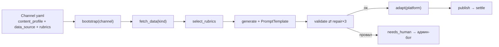

# Автоцикл Scores24 SMM

Человек не собирает день. Он разбирает только ошибки валидатора.

## Destination = конфиг, не код

Новая страна/канал того же типа контента — `config/channels/<slug>.yaml`:

| Поле | Зачем |
|---|---|
| `locale`, `platform`, `credentials_ref` | куда и на каком языке |
| `content_profile` | какой набор узлов (`predictions_smm` / …) |
| `rubrics[]` | сколько каких постов и слоты |
| `data_source{kind,path,params}` | откуда факты (реестр `smm/data_sources.py`) |
| `prompt_ids` | какие skill-файлы для copy/validate/repair |

## Источник данных

| kind | Когда |
|---|---|
| `scores24_top` | GET path из yaml + `SCORES24_INTERNAL_REQUEST` |
| `json_incoming` | только `data/incoming` / POST `/ingest` |

Узел графа один: `fetch_data`. Новый endpoint = новая функция в реестре + kind в yaml.

## Генератор (~09:30 `generate_at`)

1. `bootstrap` — channel → state (locale, prompts, rubrics).
2. `fetch_data` → `select_rubrics` (коридоры кэфа).
3. `generate` — каркас + intro (PromptTemplate + locale) + Pillow.
4. `validate` ⇄ `repair` (ошибки → точечный ремонт) ×3.
5. `adapt` → `approved` → слот → `publish` → `settle`.

## Документы

- [Для_SMM.md](./Для_SMM.md) — что делать в чате
- [ОТЧЕТ_архитектура_пайплайна.md](./ОТЧЕТ_архитектура_пайплайна.md) — узлы графа и state
- [ОТЧЕТ_валидатор.md](./ОТЧЕТ_валидатор.md) — правила валидатора
